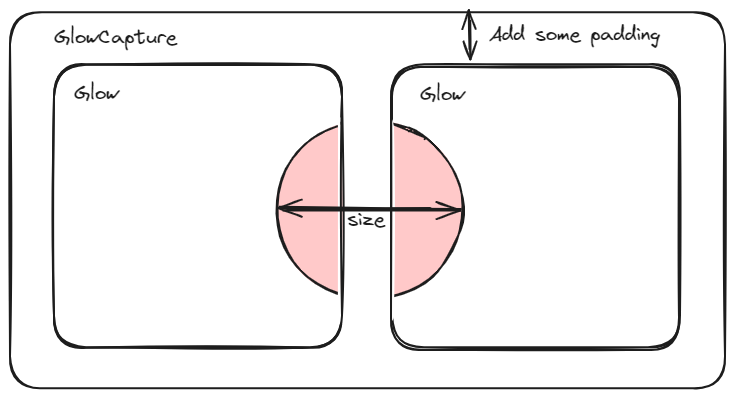

# React glow

Add a mouse-tracing glow effect to React components.


The glow effect will only work using the mouse as the pointer. Touch events will not trigger it.

See it live on [codaworks.com](https://codaworks.com).


## Installation
Install the package with npm:

```shell
npm i @codaworks/react-glow
```

## Usage
Wrap any number of `<Glow>` components in a `<GlowCapture>` which will be used to track the mouse location.


```jsx
<GlowCapture>
  <span>This won't glow</span>
  <Glow color='purple'>
    <span className='text-black glow:text-glow/50 glow:bg-red-100'>
      This will glow purple when the mouse is passed over
    </span>
  </Glow>
</GlowCapture>
```

Children of `<Glow>` can style themselves how to look when glowing. You might choose to leave some children unchanged, or highlight them with the `glow:` variant style.

The value of `color` will be available as a CSS variable `--glow-color`, as well as the Tailwind `glow` color. 
You can pass any valid CSS color, including `hsl()` values etc.
Of course, you might choose to use any other color; you can leave out the `color` prop entirely.


## Tailwind
Add the tailwind plugin to unlock the `glow:` variant and `glow` color

`tailwind.config.js`
```js
module.exports = {
  ...
  plugins: [
    require('@codaworks/react-glow/tailwind')
  ]
}
```

As with all colors in Tailwind, you may add opacity by appending a percentage after the color, such as `bg-glow/20` for 20% opacity.

## Vanilla CSS
You can style the glow effect with vanilla CSS:


```jsx
<GlowCapture>
  <span>This won't glow</span>
  <Glow color='hsl(338.69 100% 48.04%)'>
    <span className='glowable-text'>
      This will glow pink when the mouse is passed over
    </span>
  </Glow>
</GlowCapture>
```

```css
.glowable-text {
  color: black;
}

[glow] .glowable-text {
  color: var(--glow-color);
}
```

## How does it work?

The `<Glow>` component clones the children tree. The cloned tree is then stacked on top of the original tree.

The overlay tree is transparent, and we only reveal parts using a CSS radial gradient mask. The mask position is updated 
by tracking the mouse position.
When you use the `glow:` variant or `[glow]` attribute selector, it only targets the overlay. 

In order to not block mouse events, the overlay is set to `pointer-events: none`.

We use the `<GlowCapture>` to track the mouse; the `<Glow>` itself also keeps track of its position inside the `<GlowCapture>`.

### Best practices 



The fact that we clone the children tree has some implications that is important to keep in mind:

- `<Glow>` children should never have side effects. Since we duplicate the children, the effects will run twice. 
- Keep the `<Glow>` children small. Use a separate `<Glow>` for each logical set of children (such as a single card).
- Don't apply layout styles to `glow:`. Keep the glow styles to just visuals, such as colors, opacity, and a slight scale might also work sometimes.
- Use callback refs: When you pass a ref to a glow child, the cloned version will "steal" the ref. Use a callback ref, and check if it is already set before assigning.
- It might be challenging to get it to correctly work with forms, especially if you have required fields. The cloned fields will also be marked as required and failing the validation.
- Use a single `<GlowCapture>` for a group of related glows. This allows you to get an overflowing glow effect when the mouse is between 2 glows.
- Apply some padding between the capture and the children, to show the glow even when you leave the `<Glow>` instead of abruptly cutting off the effect.


## Attribution
Inspired by [this tweet](https://twitter.com/codepen/status/1696297659663888490).
